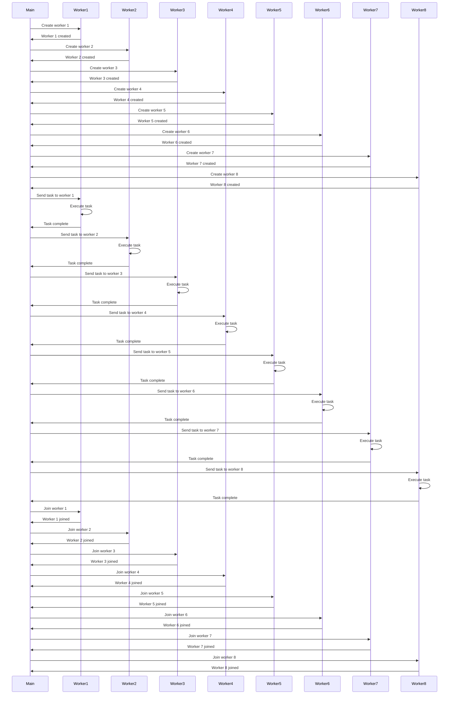

## AI MODEL   👋

```mermaid
sequenceDiagram
    participant Main
    participant Worker1
    participant Worker2
    participant Worker3
    participant Worker4
    participant Worker5
    participant Worker6
    participant Worker7
    participant Worker8

    Main ->> Worker1: Create worker 1
    Worker1 ->> Main: Worker 1 created
    Main ->> Worker2: Create worker 2
    Worker2 ->> Main: Worker 2 created
    Main ->> Worker3: Create worker 3
    Worker3 ->> Main: Worker 3 created
    Main ->> Worker4: Create worker 4
    Worker4 ->> Main: Worker 4 created
    Main ->> Worker5: Create worker 5
    Worker5 ->> Main: Worker 5 created
    Main ->> Worker6: Create worker 6
    Worker6 ->> Main: Worker 6 created
    Main ->> Worker7: Create worker 7
    Worker7 ->> Main: Worker 7 created
    Main ->> Worker8: Create worker 8
    Worker8 ->> Main: Worker 8 created
    Main ->> Worker1: Send task to worker 1
    Worker1 ->> Worker1: Execute task
    Worker1 ->> Main: Task complete
    Main ->> Worker2: Send task to worker 2
    Worker2 ->> Worker2: Execute task
    Worker2 ->> Main: Task complete
    Main ->> Worker3: Send task to worker 3
    Worker3 ->> Worker3: Execute task
    Worker3 ->> Main: Task complete
    Main ->> Worker4: Send task to worker 4
    Worker4 ->> Worker4: Execute task
    Worker4 ->> Main: Task complete
    Main ->> Worker5: Send task to worker 5
    Worker5 ->> Worker5: Execute task
    Worker5 ->> Main: Task complete
    Main ->> Worker6: Send task to worker 6
    Worker6 ->> Worker6: Execute task
    Worker6 ->> Main: Task complete
    Main ->> Worker7: Send task to worker 7
    Worker7 ->> Worker7: Execute task
    Worker7 ->> Main: Task complete
    Main ->> Worker8: Send task to worker 8
    Worker8 ->> Worker8: Execute task
    Worker8 ->> Main: Task complete
    Main ->> Worker1: Join worker 1
    Worker1 ->> Main: Worker 1 joined
    Main ->> Worker2: Join worker 2
    Worker2 ->> Main: Worker 2 joined
    Main ->> Worker3: Join worker 3
    Worker3 ->> Main: Worker 3 joined
    Main ->> Worker4: Join worker 4
    Worker4 ->> Main: Worker 4 joined
    Main ->> Worker5: Join worker 5
    Worker5 ->> Main: Worker 5 joined
    Main ->> Worker6: Join worker 6
    Worker6 ->> Main: Worker 6 joined
    Main ->> Worker7: Join worker 7
    Worker7 ->> Main: Worker 7 joined
    Main ->> Worker8: Join worker 8
    Worker8 ->> Main: Worker 8 joined


```

